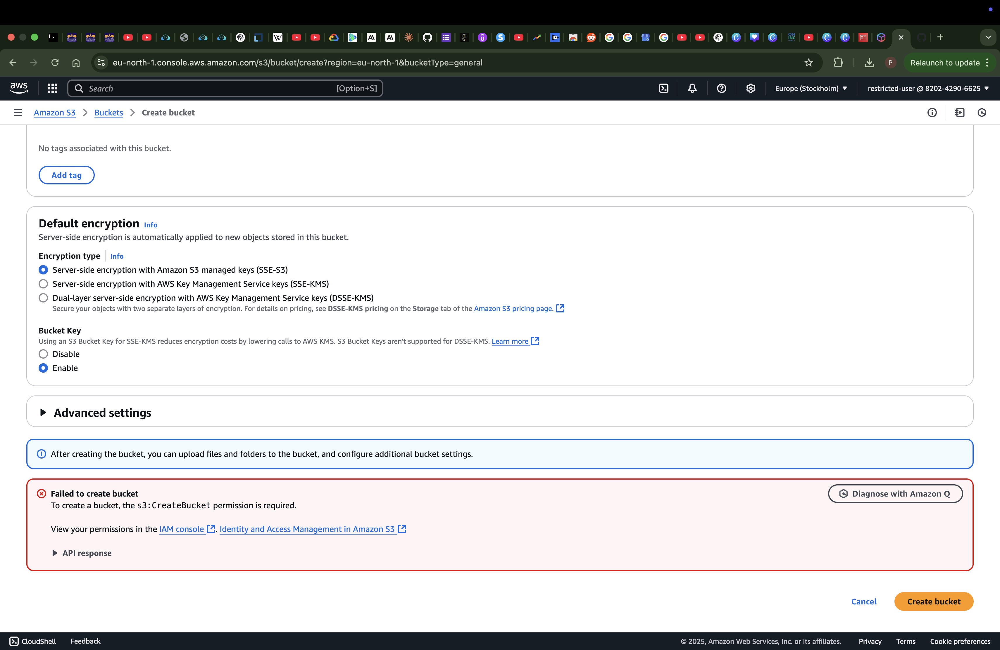
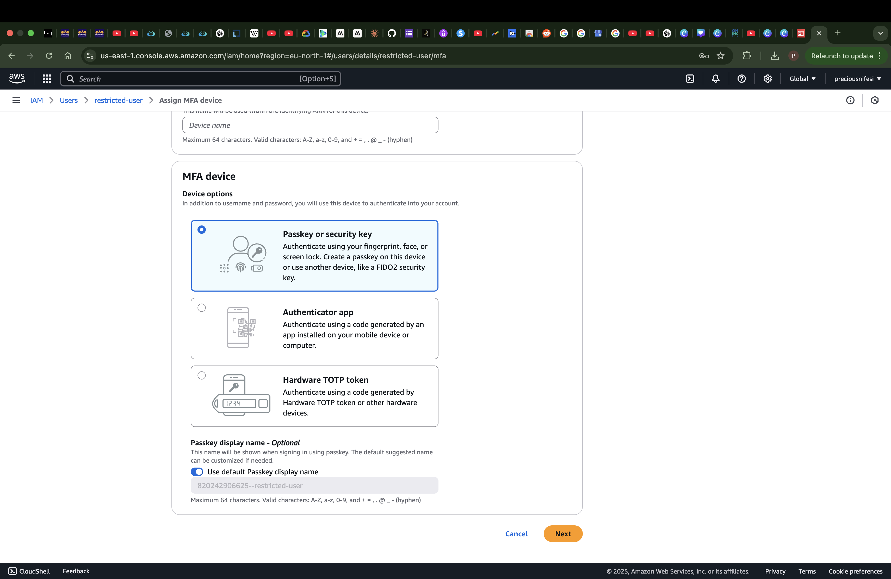
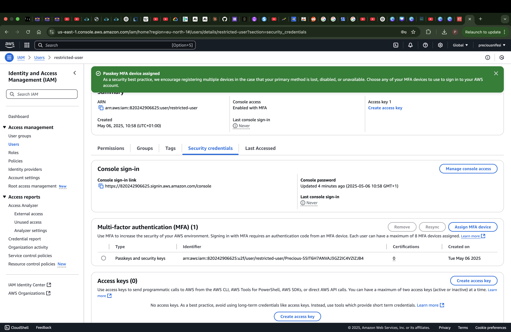
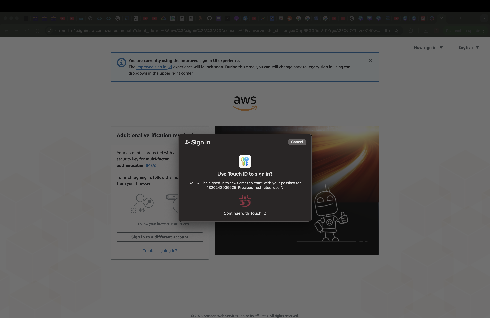
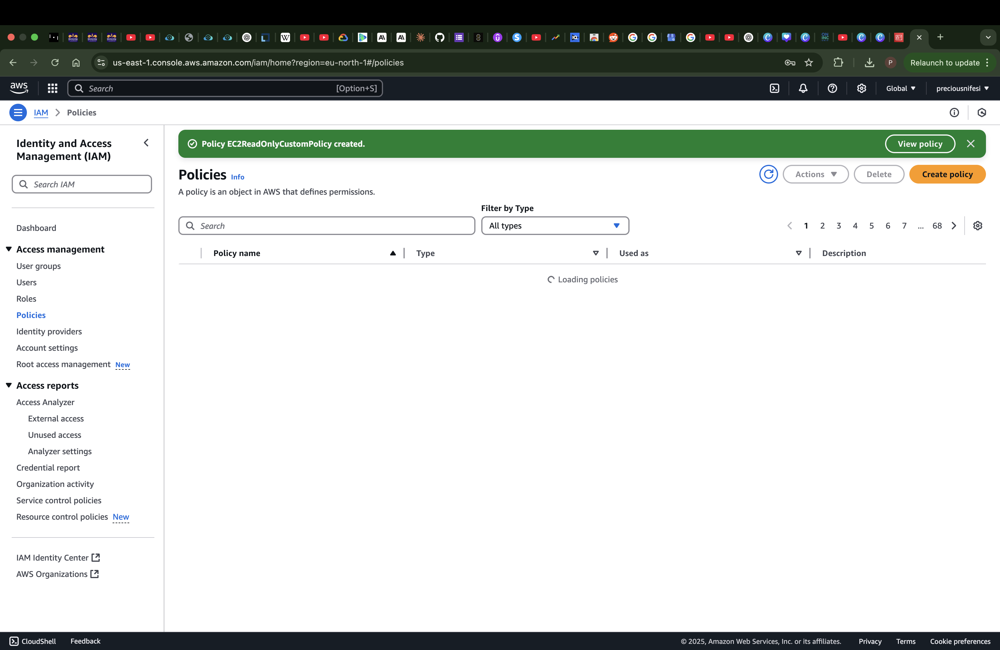
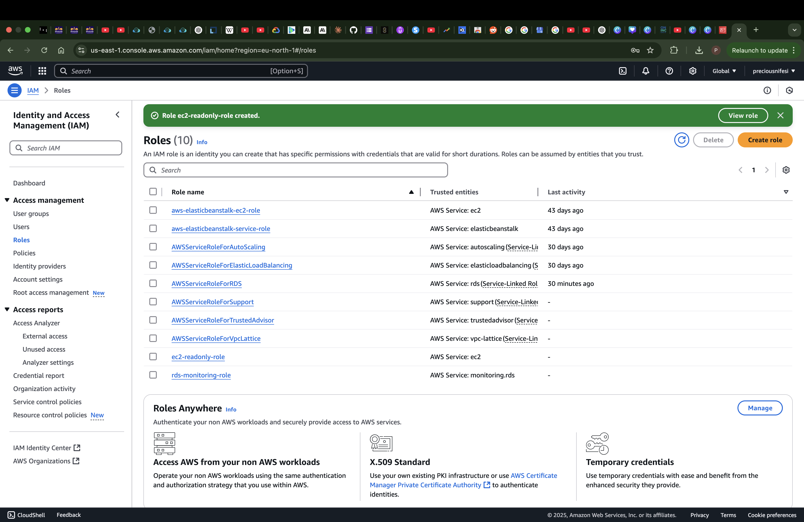
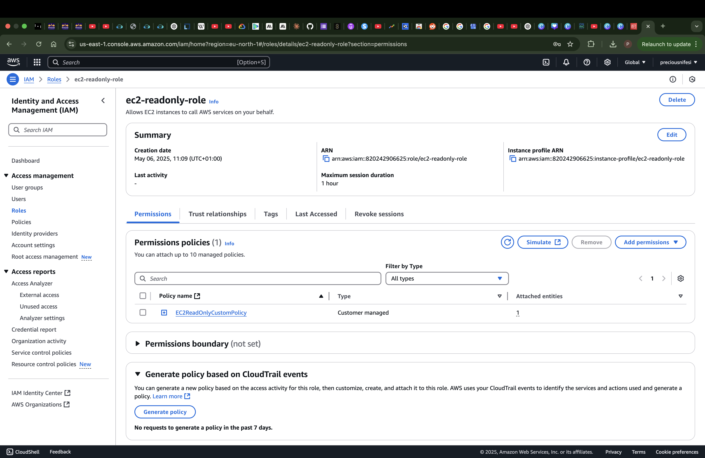

# aws-security-identity
# AWS Security & Identity Assignment

## 1. Create IAM User with Restricted Permissions
- User: `restricted-user`
- Permission: AmazonS3ReadOnlyAccess
- Tested with access to create S3 bucket(denied)
- 
  
## 2. Setup MFA
- Used Passcode
- Creating MFA
- 
- Created MFA
- 
- Successfully tested MFA login
- 

## 3. Custom Policy and Role
- Policy: `EC2ReadOnlyCustomPolicy`
- Role: `ec2-readonly-role`
  
### Screenshots
- Allows EC2 describe actions only
- 
- Creating Role
- 
- Attached a custom policy to an IAM role
- 

